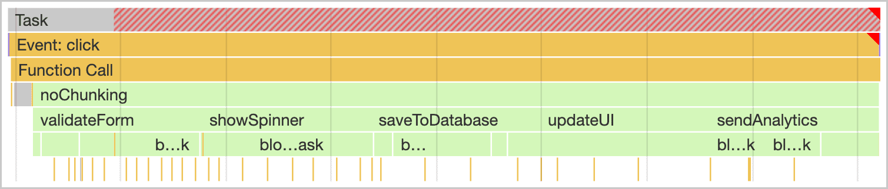
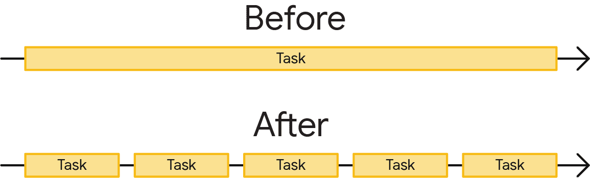
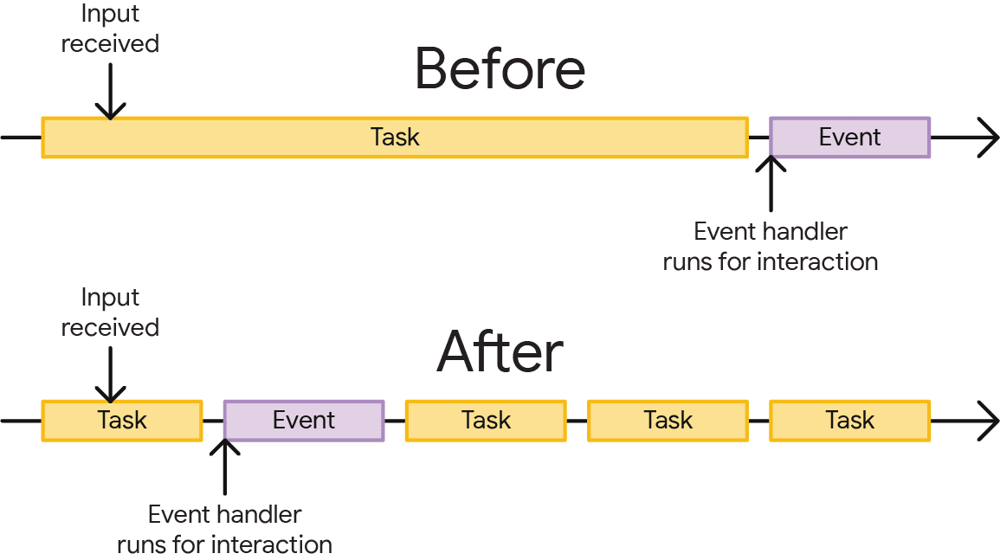

在无痕模式开启lighthouse,防止插件等其他因素的影响
## LCP(Largest Contentful Paint)

LCP 会报告视口中可见的最大图片或文本块的呈现时间

对于视频会判断封面时间和第一帧呈现时间中较短的为准

## CLS(Cumulative Layout Shift)
衡量页面整个生命周期中不符合预期的布局偏移

## TTFB(加载第一个字节所需时间)
用于衡量从请求资源到响应的第一个字节开始到达的时间点之间的时长

## FCP(First Contentful Paint)
衡量从用户首次导航到网页到网页内容的任何部分在屏幕上呈现的时间

## TBT(Total Blocking Time) 
衡量在 First Contentful Paint (FCP) 之后主线程被阻塞的时间足以阻止输入响应的总时间

主线程“阻塞”因为浏览器无法中断正在进行的任务。因此，如果用户在长时间运行的任务过程中与页面交互，浏览器必须等待任务完成后才能响应。

如果任务时间足够长（超过 50 毫秒），用户很可能会注意到延迟，并认为网页运行缓慢或已损坏。

## INP(Interaction to Next Paint)
评估网页对用户互动的总体响应情况。最终 INP 值是观测到的最长互动时间

## 优化INP
### 优化js长任务
主线程是大多数任务在浏览器中运行的位置，您编写的几乎所有 JavaScript 都在主线程中执行。

主线程一次只能处理一个任务。任何耗时超过 50 毫秒的任务都属于耗时较长的任务。对于超过 50 毫秒的任务，其总时间减去 50 毫秒后，称为任务的阻塞期。

浏览器会在任何长度的任务运行时阻止交互，但只要任务运行时间不过长，用户就不会察觉到这种情况。但是，如果用户在执行许多耗时较长的任务时尝试与页面进行交互，界面会感觉无响应，如果主线程长时间处于阻塞状态，甚至可能被破坏。



为防止主线程被阻塞的时间过长，您可以将一个长任务拆分为几个较小的任务。



这一点很重要，因为当任务分解时，浏览器可以更快地响应优先级更高的工作，包括用户互动。之后，剩余任务会运行完成，确保您最初加入队列的工作已经完成。



手动推迟代码执行

开发人员用来将任务分解为较小任务的一种方法是setTimeout()

```js
function yieldToMain () {
  return new Promise(resolve => {
    setTimeout(resolve, 0);
  });
}

async function saveSettings () {
  // Create an array of functions to run:
  const tasks = [
    validateForm,
    showSpinner,
    saveToDatabase,
    updateUI,
    sendAnalytics
  ]

  // Loop over the tasks:
  while (tasks.length > 0) {
    // Shift the first task off the tasks array:
    const task = tasks.shift();

    // Run the task:
    task();

    // Yield to the main thread:
    await yieldToMain();
  }
}
```

### 优化输入延迟
输入延迟是从用户首次与页面交互（例如点击屏幕、点击鼠标或按下按键）到交互的事件回调开始运行的时间段。每次交互开始时都会有一定量的输入延迟。

部分输入延迟是不可避免的：操作系统总是需要一些时间来识别输入事件并将其传递给浏览器。然而，这部分输入延迟通常甚至不引人注意，并且页面本身还会发生其他事情，这些事情可能会导致输入延迟时间长到足以引起问题。

#### 避免重复定时器启动过多的主线程工作
JavaScript 中有两个常用的计时器函数可能会导致输入延迟：setTimeout和setInterval

回调应该不应该太耗时，因为他会占据主线程，浏览器也就无法对用户操作进行响应

#### 交互重叠
在进行页面上一个元素的操作后，用户在初始交互的渲染下一帧之前又对页面进行了另一个交互

当用户快速交互时，例如迅速点击多个按钮或快速滚动页面，每次交互可能导致页面重新渲染。
如果用户在前一个交互的渲染结果还未显示在屏幕上时就进行了下一个交互，可能会引起页面渲染的混乱或不完整显示。
这种情况下，页面可能会出现闪烁、卡顿或用户体验下降的情况，因为浏览器无法在短时间内有效地处理和响应连续的交互请求。

通过节流防抖可以优化它，另外，请确保避免使用非合成动画，以便动画主要在 GPU 和合成器线程上运行，而不是在主线程上运行。

#### 客户端渲染
使用 JavaScript 渲染 HTML 与渲染服务器发送的 HTML 不同

服务器可以尽快开始发送 HTML，而浏览器不等待整个响应到达，则浏览器可以在 HTML 到达时分块处理它（流式传输）.浏览器在处理每个块之后会定期让位于主线程，从而避免了长时间的任务

虽然每个页面的导航请求都需要服务器提供一定数量的 HTML，但有些网站会使用 SPA 模式。这种方法通常涉及服务器提供最少的 HTML 初始负载，但随后客户端将使用从服务器获取的数据组装的 HTML 填充页面的主要内容区域。后续导航（在这种情况下有时称为“软导航”）完全由 JavaScript 处理，以使用新 HTML 填充页面。

这种情况下

1. 客户端上的 JavaScript 任务不会自动分块，这可能会导致阻塞主线程的长任务。这意味着，如果您在客户端上一次创建过多的 HTML/DOM，则页面的 INP 可能会受到负面影响
2. 浏览器预加载扫描器将无法发现其中引用的资源。这肯定会对页面的最大内容绘制 (LCP)产生负面影响

#### 如何应对客户端渲染对性能的影响
1. 服务端渲染
2. 限制在客户端创建的 DOM 节点数量
### 使用 Web Worker 在浏览器的主线程之外运行 JavaScript 
默认情况下，JavaScript 是一种在主线程上运行任务的单线程语言。不过，Web Worker 让开发者能够启动单独的线程来处理主线程以外的工作，为主线程提供了一种缓解办法。

:::tip
注意 ：请勿将 Web Worker 与 Service Worker 或 worklet 混淆。虽然名称相似，但功能和用途有所不同。
:::

如需创建 Web Worker，请将文件传递给 worker 构造函数，后者开始在单独的线程中运行该文件：
```js
const worker = new Worker("./worker.js");
```

通过 postMessage API 发送消息，与 Web Worker 通信。在 postMessage 调用中将消息值作为参数传递，然后向 worker 添加消息事件监听器：

有两点需要注意

1. 您只是从主线程移动工作，并未减少工作。
2. Web Worker 与主线程之间的额外通信开销有时可能会略微减慢速度。

:::tip
也需要考虑主线程和 Web 工作器之间复制复杂对象的成本,但一般而言，如果对象的字符串化 JSON 表示法小于 10 KB，您应该不会超出性能预算。如果您需要复制较大的对象，请考虑使用 ArrayBuffer 或 WebAssembly
:::

### 拆分较大的js文件
脚本评估是在浏览器中执行 JavaScript 的必要部分，因为 JavaScript 是在执行前即时编译的。评估脚本时，系统会先解析脚本是否存在错误。如果解析器没有发现错误，会将脚本编译成字节码，然后继续执行。

某个网页已呈现并不意味着该网页已完成加载。由于网页正忙于评估脚本，加载期间发生的互动可能会延迟。虽然无法保证在此时间点能发生互动（因为执行互动的脚本可能尚未加载），但存在依赖于 JavaScript 的互动可能已经就绪，或者互动完全不依赖于 JavaScript。

:::tip
由于设备功能不同，因此很难为单个脚本的大小设定固定上限。为了在压缩效率、下载时间和脚本评估时间之间取得较好的平衡，最好将每个脚本限制为 100 KB。
:::

拆分脚本可以确保您不会执行一个可能阻塞主线程的大型任务，而是执行大量不会阻塞主线程的小任务

#### 加载动态脚本import()
动态import()调用可以出现在脚本中的任何位置，以根据需要加载一段 JavaScript。这种技术称为代码拆分。

Dynamicimport()在改进INP方面有两个优势：

1. 推迟加载的模块通过减少当时加载的 JavaScript 数量来减少启动期间的主线程争用。这释放了主线程，使其能够更快地响应用户交互。
2. 当进行动态import()调用时，每次调用都会有效地将每个模块的编译和评估分离到其自己的任务中。当然，import()加载非常大模块的动态将启动相当大的脚本评估任务，如果交互与动态调用同时发生，这可能会干扰主线程响应用户输入的能力import()。因此，尽可能少地加载 JavaScript 仍然非常重要。

#### 压缩效率
压缩是拆分脚本时需要考虑的一个因素。脚本越小，压缩的效率就越低。脚本越大，压缩的效果就越好。虽然提高压缩效率有助于尽可能缩短脚本的加载时间，但确保将脚本拆分成足够小的块，以便在启动时实现更好的交互性，这需要一定的平衡。
#### 缓存失效

通过拆分脚本，您不仅可以将脚本评估工作拆分为多个较小的任务，还可以增加回访者从浏览器缓存而不是网络获取更多脚本的可能性。这意味着整体页面加载速度更快。

:::tip 关键点：
为了使缓存高效并且避免从缓存中提供过时的资源，请确保捆绑程序生成的资源的文件名中带有哈希值。
:::