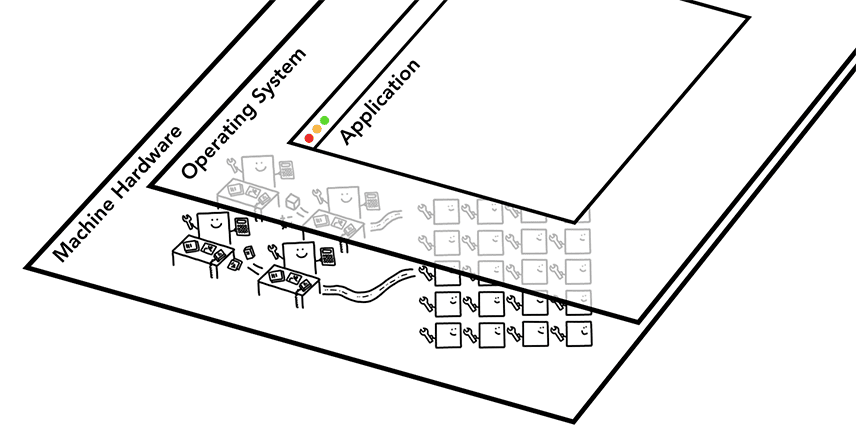
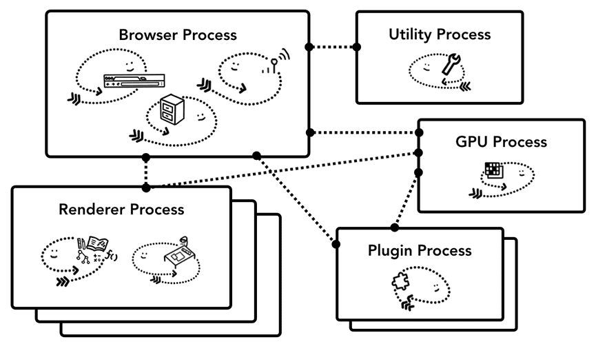

cpu(Central Processing Unit) gpu(Graphics Processing Unit) 是浏览器的核心 ， 操作系统是中间层 ，最外层是应用层

另外还需要了解的是Process和Thread。

进程可以描述为应用程序的执行程序。线程存在于进程内部并执行其进程程序的任何部分。

当您启动应用程序时，会创建一个进程。程序可能会创建线程来帮助其工作。操作系统为进程提供了一块“内存”供其使用，并且所有应用程序状态都保存在该私有内存空间中。当您关闭应用程序时，进程也会消失，操作系统会释放内存。

进程可以请求操作系统启动另一个进程来运行不同的任务。当这种情况发生时，内存的不同部分将分配给新进程。如果两个进程需要通信，它们可以使用进程间通信 (IPC) 进行通信
## 谷歌浏览器的架构
最顶层是browser，它与负责应用程序不同部分的其他进程进行协调。对于渲染器进程，会创建多个进程并将其分配给每个选项卡

| Process  | What it controls |
|----------|------------------|
| Browser  | 控制应用的chrome部分, 包括地址栏,书签,前进后退按钮.也处理不可见的权限部分,例如网络请求和文件访问. |
| Renderer | 控制选项卡下网站展示的部分 |
| Plugin   | 控制网站使用的任何插件，例如 flash. |
| GPU      | 处理GPU任务,独立于其他进程.它被分成不同的进程，因为 GPU 处理来自多个应用程序的请求并将它们绘制在同位置. |

还有更多进程，例如扩展进程和实用程序进程。
## 导航
重点介绍用户请求网站和浏览器准备呈现页面的部分，从browser Process开始

标签之外的所有内容均由浏览器进程处理。浏览器进程具有多个线程，例如绘制浏览器按钮和输入字段的 UI 线程、处理网络堆栈以从互联网接收数据的网络线程、控制文件访问的存储线程等。当您在地址栏中键入 URL 时，您的输入由浏览器进程的 UI 线程处理。
### 处理input
当用户尝试在地址栏输入，UI thread 会询问这是一个搜索查询还是URL,因此UI thread 需要解析并决定发送到搜索引擎还是站点
### 开始导航
当按下Enter,UI thread 会发起Network call ,network thread 会执行适当的协议，例如 DNS 查找和为请求建立 TLS 连接。

此时，network thread 可能收到服务器重定向标头，在这种情况下，network thread 会与UI thread通信，告知服务器正在请求重定向，然后发起另一个URL请求
### 查阅respond
一旦响应体进入，network thread 会在必要时查看stream的前几个字节。响应的 Content-Type 标头应该会说明它是什么类型的数据，但由于它可能缺失或错误，因此 MIME 类型嗅探 在此完成

如果是一个html文件，下一步将它交给renderer Process,如果是zip格式或者一些其他类型，则会交给下载管理器

这也是 safebrowsing发生的地方，如果域和响应数据匹配到未知的恶意站点，network thread 将发出警报展示一个warning page

此外也会进行cors检查，以确保敏感的跨站点数据不要进入 renderer Process
### 查询 renderer process
当所有的检查通过，并且network thread确信浏览器应该导航到请求的站点，network thread告知UI thread 数据就绪。UI thread 将找到renderer process 继续网页渲染

由于网络请求可能需要几百毫秒才能得到响应，因此当 UI thread 在步骤 2 向network thread发送 URL 请求时，它已经知道它们正在导航到哪个站点。UI thread尝试在网络请求的同时主动查找或启动渲染器进程。这样，如果一切按预期进行，当network thread收到数据时，渲染器进程已经处于待机状态。如果导航重定向跨站点，则可能不会使用此待机进程，在这种情况下可能需要不同的进程。

### 提交导航
现在数据和renderer thread已准备就绪，browser thread会向renderer thread发送 IPC 以提交导航。它还会传递数据流，以便渲染器进程可以继续接收 HTML 数据。一旦浏览器进程收到渲染器进程中已提交的确认，导航即完成，文档加载阶段开始。

导航提交后，renderer thread将继续加载资源并渲染页面。渲染器进程“完成”渲染后，它会将 IPC 发送回浏览器进程（这是 onload在页面所有帧上触发所有事件并完成执行之后）。此时，UI 线程停止选项卡loading

这里的完成，是不考虑 在这之后 用户端js能加载额外的资源和渲染新视图

## 渲染进程的内部工作原理
渲染进程的核心工作是将 HTML、CSS 和 JavaScript 转换为用户可以交互的网页。

### 解析
解析DOM：当渲染进程收到导航的提交消息并开始接收 HTML 数据时，主线程开始解析文本字符串（HTML）并将其转换为DOM。

加载子资源：网站通常会使用外部资源，如图片、CSS 和 JavaScript。这些文件需要从网络或缓存中加载。主线程可以在解析构建 DOM 时逐个请求它们，但为了加快速度，“proload scanner”会同时运行。

如果 HTML 文档中有img或link 之类的内容，预加载扫描器会查看 HTML 解析器生成的标记，并在 browser process中向network thread发送请求。

当 HTML 解析器发现标签时script，它会暂停 HTML 文档的解析，并加载、解析和执行 JavaScript 代码

### 提示浏览器如何加载资源
如果不希望阻塞解析，则可以将async或defer属性添加到script标签中。然后，浏览器会异步加载和运行 JavaScript 代码，并且不会阻止解析。如果合适，您也可以使用JavaScript 模块。link rel="preload"是一种通知浏览器当前导航肯定需要该资源并且希望尽快下载的方法。

### 样式计算
主线程解析 CSS 并确定每个 DOM 节点的计算样式。这是关于根据 CSS 选择器将哪种样式应用于每个元素的信息。
### 布局
现在，渲染器进程知道了文档的结构和每个节点的样式，但这还不足以渲染页面。想象一下，你正试图通过电话向朋友描述一幅画。“有一个大红圆圈和一个小蓝方块”这些信息不足以让你的朋友知道这幅画到底是什么样子。

布局是查找元素几何形状的过程。主线程遍历 DOM 和计算样式，并创建包含 xy 坐标和边界框大小等信息的布局树。布局树的结构可能与 DOM 树相似，但它仅包含与页面上可见内容相关的信息。如果display: none应用了，则该元素不是布局树(layout tree)的一部分（但是，具有 的元素visibility: hidden位于布局树中）。同样，如果应用了具有类似内容的伪元素p::before{content:"Hi!"}，则即使它不在 DOM 中，它也包含在布局树中。
### paint
知道这些还不够，还需要判断绘制的顺序，设置了z-index会导致错误的渲染