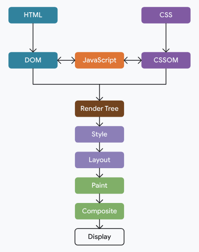

如果浏览器在只有一些 HTML 时（但在任何 CSS 或必要的 JavaScript 之前）尽快渲染，那么页面将暂时看起来不完整，并且在最终渲染时会发生很大变化。这比最初显示一段时间的空白屏幕更糟糕，直到浏览器拥有更多此类资源才能提供更好的用户体验。

另一方面，如果浏览器等待所有资源可用而不是进行任何顺序渲染，那么用户将需要等待很长时间；如果页面在更早的时间点可用，则通常是不必要的。

渲染路径涉及以下步骤：

1. 从 HTML 构建文档对象模型 (DOM)。
2. 从 CSS 构建 CSS 对象模型 (CSSOM)。
3. 应用任何改变 DOM 或 CSSOM 的 JavaScript。
4. 从 DOM 和 CSSOM 构建渲染树。
5. 在页面上执行样式和布局操作以查看哪些元素适合在哪里。
6. 在内存中绘制元素的像素。
7. 如果其中任何一个像素重叠，则将其合成。
8. 将所有生成的像素物理地绘制到屏幕上。

## 关键渲染路径上有哪些资源？
浏览器需要等待一些关键资源下载后才能完成初始渲染。这些资源包括：

* HTML 的一部分。
* 元素中的渲染阻止 CSS `<head>`。
* 元素中的阻止渲染的 JavaScript `<head>`。

关键点在于，浏览器以流式方式处理 HTML。浏览器一收到页面 HTML 的任何部分，就会开始处理它。然后，浏览器就可以（而且通常会）在收到页面 HTML 的其余部分之前决定渲染它。

重要的是，对于初始渲染，浏览器通常不会等待：

* 全部 HTML。
* 字体。
* 图片。
* 元素外部的非渲染阻塞 JavaScript `<head>`（例如， `<script>`放置在 HTML 末尾的元素）。
* 元素外部的非渲染阻塞 CSS `<head>`，或具有 不适用于当前视口的media属性值的 CSS。

## 预加载扫描器
预加载扫描器是一种浏览器优化，辅助 HTML 解析器的进行，它会扫描原始 HTML 响应，先将资源下载下来。

即使 HTML 解析器在获取和处理 CSS 和 JavaScript 等资源时被阻止，预加载扫描器也会允许浏览器开始下载元素中指定的资源。

要利用预加载扫描器，服务器发送的 HTML 标记中应包含关键资源。预加载扫描器无法发现以下资源加载模式：

* CSS 使用background-image属性加载的图像。这些图像引用位于 CSS 中，无法被预加载扫描仪发现。
* 以元素标记的形式`<script>`使用 JavaScript 注入到 DOM 中或使用动态import()加载的模块来动态加载脚本。
* 使用 JavaScript 在客户端上呈现的 HTML。此类标记包含在 JavaScript 资源的字符串中，预加载扫描器无法发现。
* CSS@import声明。

这些资源加载模式都是后期发现的资源，因此无法从预加载扫描器中获益。尽可能避免使用它们。但是，如果无法避免此类模式，您可以使用 preload提示来避免资源发现延迟。