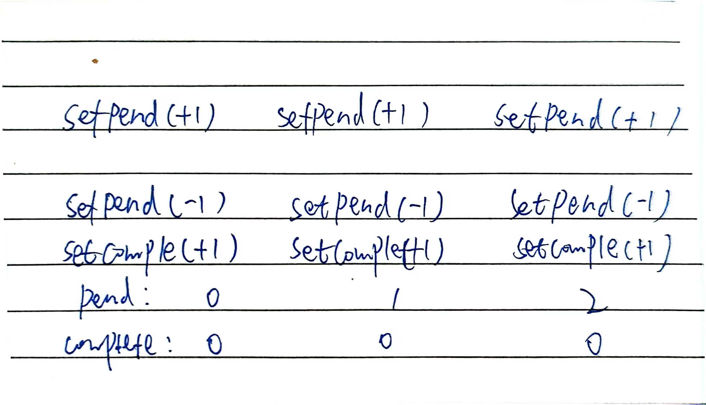

```jsx
function example() {
  let count = 0;
  function handleClick() {
    ++count;
  }
  return (
    <>
      <div>{count}</div>
      <button onClick={handleClick}>add</button>
    </>
  );
}
```

不会有任何变化

handleClick() 事件处理函数正在更新局部变量 count

- 更新局部变量 react 不会触发渲染， React 没有意识到它需要使用新数据再次渲染组件。
- 就算 react 重新渲染，再次执行这个函数，之前修改的局部变量修改已经丢失，渲染的结果都是一样的

要使用新数据更新组件，需要做两件事：

- 保留 渲染之间的数据。
- 触发 React 使用新数据渲染组件（重新渲染）。

useState Hook 提供了这两个功能：

- State 变量 用于保存渲染间的数据。
- State setter 函数 更新变量并触发 React 再次渲染组件。

## useState

```js
const [index, setIndex] = useState(0);
```

1. 组件进行第一次渲染。 因为你将 0 作为 index 的初始值传递给 useState，它将返回 [0, setIndex]。 React 记住 0 是最新的 state 值。
2. 你更新了 state。当用户点击按钮时，它会调用 setIndex(index + 1)。 index 是 0，所以它是 setIndex(1)。这告诉 React 现在记住 index 是 1 并触发下一次渲染。
3. 组件进行第二次渲染。React 仍然看到 useState(0)，但是因为 React 记住 了你将 index 设置为了 1，它将返回 [1, setIndex]。
4. 以此类推！

## 赋予一个组件多个 state 变量

useState 在调用时没有任何关于它引用的是哪个 state 变量的信息。没有传递给 useState 的“标识符”，它是如何知道要返回哪个 state 变量呢

相反，为了使语法更简洁，在同一组件的每次渲染中，Hooks 都依托于一个稳定的调用顺序

在 React 内部，为每个组件保存了一个数组，其中每一项都是一个 state 对。它维护当前 state 对的索引值，在渲染之前将其设置为 “0”。每次调用 useState 时，React 都会为你提供一个 state 对并增加索引值。

[React Hooks: not magic, just arrays](https://medium.com/@ryardley/react-hooks-not-magic-just-arrays-cd4f1857236e)

这个例子没有使用 React，但它让你了解 useState 在内部是如何工作的：

<iframe src="https://codesandbox.io/embed/magical-meitner-hcs52m?fontsize=14&hidenavigation=1&theme=dark"
     style="width:100%; height:500px; border:0; border-radius: 4px; overflow:hidden;"
     title="magical-meitner-hcs52m"
     allow="accelerometer; ambient-light-sensor; camera; encrypted-media; geolocation; gyroscope; hid; microphone; midi; payment; usb; vr; xr-spatial-tracking"
     sandbox="allow-forms allow-modals allow-popups allow-presentation allow-same-origin allow-scripts"
   ></iframe>

:::tip :thinking:
Hooks ——以 use 开头的函数——只能在组件或自定义 Hook 的最顶层调用。 你不能在条件语句、循环语句或其他嵌套函数内调用 Hook。
:::

再看这个例子,连续使用三次set

<iframe src="https://codesandbox.io/embed/g7f575?view=editor+%2B+preview"
     style="width:100%; height: 500px; border:0; border-radius: 4px; overflow:hidden;"
     title="一次性三次set"
     allow="accelerometer; ambient-light-sensor; camera; encrypted-media; geolocation; gyroscope; hid; microphone; midi; payment; usb; vr; xr-spatial-tracking"
     sandbox="allow-forms allow-modals allow-popups allow-presentation allow-same-origin allow-scripts"
   ></iframe>

:::details :rocket: DEEP DIVE

设置 state 只会为下一次渲染变更 state 的值

以下是这个按钮的点击事件处理函数通知 React 要做的事情：

1. setNumber(number + 1)：number 是 0 所以 setNumber(0 + 1)。

- React 准备在下一次渲染时将 number 更改为 1。

2. setNumber(number + 1)：number 是 0 所以 setNumber(0 + 1)。

- React 准备在下一次渲染时将 number 更改为 1。

3. setNumber(number + 1)：number 是 0 所以 setNumber(0 + 1)。

- React 准备在下一次渲染时将 number 更改为 1。

尽管你调用了三次 setNumber(number + 1)，但在 这次渲染的 事件处理函数中 number 会一直是 0，所以你会三次将 state 设置成 1。
:::

再看这个,使用定时器输出state
<iframe src="https://codesandbox.io/embed/x9692v?view=editor+%2B+preview&module=%2Fsrc%2FApp.js"
     style="width:100%; height: 500px; border:0; border-radius: 4px; overflow:hidden;"
     title="随时间变化的state"
     allow="accelerometer; ambient-light-sensor; camera; encrypted-media; geolocation; gyroscope; hid; microphone; midi; payment; usb; vr; xr-spatial-tracking"
     sandbox="allow-forms allow-modals allow-popups allow-presentation allow-same-origin allow-scripts"
   ></iframe>

:::details :rocket: DEEP DIVE
state 的值在渲染过程中永远不会改变

即使其事件处理程序的代码是异步的。在该渲染 中，即使在调用之后，onClick的值number仍然保持不变。当 React 通过调用您的组件“拍摄 UI 快照”时，其值已“固定”
:::
## 批处理
`React会等到事件处理程序中的所有代码都运行完毕后才处理状态更新`

但是不会批处理多个有意的event

例如有多个点击事件,是不会进行批处理

test 点击按钮等待的数量加一,三秒后完成加一,等待减一,现在多次点击等待一会,等待变成-1
<iframe src="https://codesandbox.io/embed/c8cxxs?view=editor+%2B+preview&module=%2Fsrc%2FApp.js&hidenavigation=1"
     style="width:100%; height: 500px; border:0; border-radius: 4px; overflow:hidden;"
     title="延时处理"
     allow="accelerometer; ambient-light-sensor; camera; encrypted-media; geolocation; gyroscope; hid; microphone; midi; payment; usb; vr; xr-spatial-tracking"
     sandbox="allow-forms allow-modals allow-popups allow-presentation allow-same-origin allow-scripts"
   ></iframe>

   :::details :thinking:
   
   

   改为传递更新函数，而不是将计数器设置为在点击期间确定的具体值

   这可以确保你在增加或减少计数器时是根据其 `最新 的 state` 而不是`点击时的 state `来进行增减的。 
   :::
## useState也可以传人一个函数
例如
```js
setNumber(n => n + 1)
```
这会根据队列中的前一个状态计算下一个状态

```js
setNumber(n+1)
setNumber(n+1)
setNumber(n+1)

setNumber(n=>n+1)
setNumber(n=>n+1)
setNumber(n=>n+1)
```

替换状态后更新状态

```js
<button onClick={() => {
  setNumber(number + 5);
  setNumber(n => n + 1);
}}></button>

```
:::details :rocket:
6

* setNumber(number + 5)：number是0，所以setNumber(0 + 5)。React 将“替换为5”添加到其队列中。
* setNumber(n => n + 1):n => n + 1是一个更新函数。React将该函数添加到其队列中。
:::

## 将 state 视为只读的 
`把所有存放在 state 中的 JavaScript 对象都视为只读的`

如果state保存的是对象,不能直接对对象进行修改,而是拷贝一份进行修改

可以使用immer库简化

:::tip DEEP DIVE immer原理
由 Immer 提供的 draft 是一种特殊类型的对象，被称为 Proxy，它会记录你用它所进行的操作。这就是你能够随心所欲地直接修改对象的原因所在！从原理上说，Immer 会弄清楚 draft 对象的哪些部分被改变了，并会依照你的修改创建出一个全新的对象。
:::

:::tip :rocket: 为什么在 React 中不推荐直接修改 state？
* 调试：如果你使用 console.log 并且不直接修改 state，你之前日志中的 state 的值就不会被新的 state 变化所影响。这样你就可以清楚地看到两次渲染之间 state 的值发生了什么变化
* 优化：React 常见的 优化策略 依赖于如果之前的 props 或者 state 的值和下一次相同就跳过渲染。如果你从未直接修改 state ，那么你就可以很快看到 state 是否发生了变化。如果 prevObj === obj，那么你就可以肯定这个对象内部并没有发生改变。
新功能：我们正在构建的 React 的新功能依赖于 state 被 像快照一样看待 的理念。如果你直接修改 state 的历史版本，可能会影响你使用这些新功能。
* 需求变更：有些应用功能在不出现任何修改的情况下会更容易实现，比如实现撤销/恢复、展示修改历史，或是允许用户把表单重置成某个之前的值。这是因为你可以把 state 之前的拷贝保存到内存中，并适时对其进行再次使用。如果一开始就用了直接修改 state 的方式，那么后面要实现这样的功能就会变得非常困难。
* 更简单的实现：React 并不依赖于 mutation ，所以你不需要对对象进行任何特殊操作。它不需要像很多“响应式”的解决方案一样去劫持对象的属性、总是用代理把对象包裹起来，或者在初始化时做其他工作。这也是为什么 React 允许你把任何对象存放在 state 中——不管对象有多大——而不会造成有任何额外的性能或正确性问题的原因。
:::

