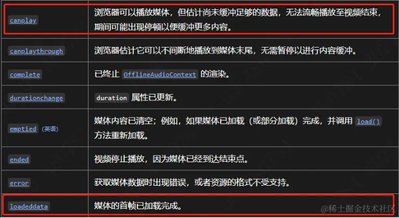

需求：

产品想要用户给视频设置封面，如果没有设置就默认取视频第一帧作为封面，难点主要是如何获取视频第一帧

*问了gpt，回答的很乱*


思路：
1. 创建一个`video`标签，将`src`设置为远程视频地址
2. 等待视频创建好之后，使用`canvas`的`drawImage`方法将视频写入到canvas中
3. 最后canvas转成base64

## 创建video标签

`crossOrigin`必须设置，[允许 CORS 的资源](https://developer.mozilla.org/zh-CN/docs/Web/HTML/CORS_enabled_image)可在 [`<canvas>`](https://developer.mozilla.org/zh-CN/docs/Web/HTML/Element/canvas) 元素中被重用，而不会被*污染*
`preload`
-   `none`: 表示不应该预加载视频。
-   `metadata`: 表示仅预先获取视频的元数据（例如长度）。
-   `auto`: 表示可以下载整个视频文件，即使用户不希望使用它。
-   *空字符串*: 与 `auto` 值一致。

 这里设置为auto,否则后面canvas拿不到数据，替代方案是设置`autoplay，muted`
 
 因为 `autoplay` 属性的优先级比 `preload` 高。如果指定了 `autoplay` 属性，浏览器显然需要开始下载视频以便回放。
```js
  const video = document.createElement('video');
    video.src = videoUrl;
    video.setAttribute('crossOrigin', 'Anonymous');
    video.setAttribute('preload', 'auto');
```
## 等待视频创建好之后在canvas进行绘制
实践发现在这两个事件里能拿到视频第一帧，下面以其中一个举例子



下面就是调用api的事情了.转成所需的图片路径可以用`toBlob`或是`toDataURL`，现在可以将其赋值给图片src查看效果了

> 乌龙：注意toDataURL转成的base64很长的话，直接键入，浏览器会截取掉一部分，导致当时调试的时候在浏览器上访问的图片只有一半。当时的解决方案是缩小canvas，但是不知道为什么，现在明白了
```js
    video.oncanplay = () => {
      const canvas = document.createElement('canvas');
      canvas.width = video.videoWidth;
      canvas.height = video.videoHeight;

      const ctx = canvas.getContext('2d');
      if (ctx) {
        ctx.imageSmoothingEnabled = true;
        ctx.imageSmoothingQuality = 'high';
        ctx.drawImage(video, 0, 0, canvas.width, canvas.height);
      }
      canvas.toBlob(
        (blob) => {
          resolve(URL.createObjectURL(blob));
        },
        'image/png',
        1,
      );
      
      //或是
      //let dataURL = canvas.toDataURL('image/png');
      //resolve(dataURL);
    };
```
### 完整代码

```js
// videoUrl 完整视频地址 获取第一帧
export function getVideoFirstFrame(videoUrl: string) {
  return new Promise((resolve, reject) => {
    const video = document.createElement('video');
    video.src = videoUrl;
    video.setAttribute('crossOrigin', 'Anonymous');
    video.setAttribute('preload', 'auto');
    // video.muted = true;
    // video.autoplay = true;

    video.onloadeddata = () => {
      const canvas = document.createElement('canvas');
      canvas.width = video.videoWidth / 1.5;
      canvas.height = video.videoHeight / 1.5;

      const ctx = canvas.getContext('2d');
      if (ctx) {
        ctx.imageSmoothingEnabled = true;
        ctx.imageSmoothingQuality = 'high';
        ctx.drawImage(video, 0, 0, canvas.width, canvas.height);
      }
      let dataURL = canvas.toDataURL('image/png');
      resolve(dataURL);
    };

    video.onerror = (error) => {
      reject(error);
    };
  });
}

//调用
  getVideoFirstFrame(videoUrl).then((updatedData) => {
        data.videoCoverUrl = updatedData;
      });
      

```
## 补充
不仅仅是视频第一帧可以截取，第几秒的视频也可以截取，实现也很简单

```js
video.currentTime = 4;
```
这样就是截取到第4s的视频图片了，还可以判断一下你的视频是否有这么长