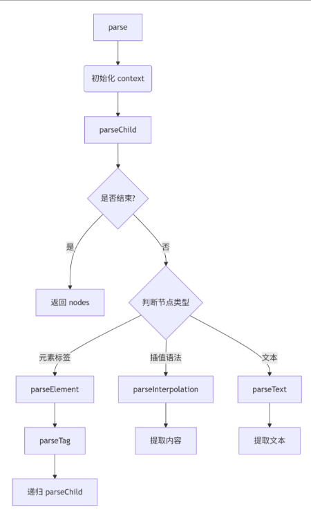

### 实现 promise.all/allSettled

- 接收一个可迭代对象
- 传入的数据中可以是普通数据，也可以是 Promise 对象
- 可迭代对象的 promise 是并行执行的
- 保持输入数组的顺序和输出数组的顺序一致
- 传入数组中只要有一个 reject，立即返回 reject
- 所有数据 resolve 之后返回结果

```js
function myPromiseAll(promises) {
  return new Promise((resolve, reject) => {
    // 1. 参数校验
    if (typeof promises?.[Symbol.iterator] !== "function") {
      return reject(new TypeError(`${typeof promises} is not iterable`));
    }

    // 2. 转换为确定长度的数组
    const promiseArr = Array.from(promises);
    const total = promiseArr.length;
    const res = [];
    let completed = 0;

    // 3. 处理空迭代器
    if (total === 0) return resolve(res);

    // 4. 遍历处理
    for (let i = 0; i < total; i++) {
      const p = promiseArr[i];
      Promise.resolve(p)
        .then((value) => {
          res[i] = value;
          completed++;
          if (completed === total) {
            resolve(res);
          }
        })
        .catch((err) => {
          reject(err);
        });
    }
  });
}
```

```js
function myPromiseAllSettle(promises){
  return new Promise((resolve,reject)=>{
    if(typeof promises[Symbol.iterator]!=='function'){
     return  reject(new TypeError(`${typeof promises} is not iterable`))
    }
    let res = []
    let complete = 0
    let pArr = Array.from(promises)
    let total = pArr.length
    if(total===0){
     return  resolve(res)
    }
  pArr.forEach((item,i)=>{
    Promise.resolve(item).then((value)=>{
      res[i] = {status:'fulfilled',value}
    }).catch(reason=>{
      res[i] = {status:'rejected',reason}
    }).finally(()=>{
      complete++
      if(complete===total){
        resolve(res)
      }
    })
  })
  })
}
```
### 防抖和节流

```js
function debounce(fn, delay) {
  let timer;
  return function (...args) {
    clearTimeout(timer);
    timer = setTimeout(() => {
      fn.apply(this, args);
    }, delay);
  };
}

function throttle(fn, delay) {
  let lastTime = 0;
  return function (...args) {
    const now = Date.now();
    if (now - lastTime >= delay) {
      fn.apply(this, args);
      lastTime = now;
    }
  };
}
```

### 深拷贝,数组打平
这类题都是一样的,要用递归

但是跟力扣里二叉树相关的还不太一样,因为二叉树没有数组这个结构,所以在dfs里要判断一下传入节点的类型是数组还是对象

一般是数组需要循环处理
```js
// 输入： cityData、 'kklio2'
// 输出： '广东省-东莞市-B区'
const cityData = [
  {
    id: "axzx",
    name: "广东省",
    children: [
      {
        id: "sdsd",
        name: "深圳市",
        children: [
          {
            id: "45dss",
            name: "南山区",
          },
          {
            id: "sdsd11",
            name: "福田区",
            children: [
              {
                id: "ddrr2",
                name: "A街道",
              },
            ],
          },
        ],
      },
      {
        id: "2323d",
        name: "东莞市",
        children: [
          {
            id: "xxs2",
            name: "A区",
          },
          {
            id: "kklio2",
            name: "B区",
          },
        ],
      },
    ],
  },
];
function search(cityData, key) {
  let path = [];
  let res = [];
  function dfs(node) {
    if (!node) {
      return;
    }
    if (Array.isArray(node)) {
      for (let i = 0; i < node.length; i++) {
        dfs(node[i]);
      }
    } else {
      path.push(node.name);
      if (node.id === key) {
        res = [...path];
        return;
      } else {
        dfs(node.children);
      }
      path.pop();
    }
  }
  dfs(cityData);
  return res;
}
console.log(search(cityData, "45dss"));
```
### Proxy
get要return值,set return false会报错
// 实现 handler 函数以达到以下输出效果：

```js
const proxy = new Proxy({}, handler);
proxy.a = 10;
console.log(proxy.a); // 输出 10
console.log(proxy.b); // 输出 'default'
proxy.a = 'string';
console.log(proxy.a); // 输出 10
```

```js
const handler = {
  get(target, prop) {
    if(prop==='a'){
        return target[prop]
    }else{
        return 'default'
    }
  },
  set(target, prop, value) {
    if (prop === "a") {
      if (typeof value === "number") {
        target[prop] = value;
      }
    } else {
      target[prop] = value;
    }
    return true; // 必须返回 true 表示操作成功
  },
};
```
### js大数相加
转成字符串在reverse处理

```js
// js实现大数相加
function sum(a, b) {
  a += ''
  b += ''
  let arr1 = a
    .split('')
    .reverse()
    .map((item) => +item)
  let arr2 = b
    .split('')
    .reverse()
    .map((item) => +item)
  let add = 0
  let res = []
  let max = Math.max(arr1.length, arr2.length)
  for (let i = 0; i < max; i++) {
    let num1 = arr1[i] || 0
    let num2 = arr2[i] || 0
    res.push((num1 + num2 + add) % 10)
    if (num1 + num2 + add >= 10) {
      add = 1
    } else {
      add = 0
    }
    console.log(num1 + num2 + add)
  }
  if (add) {
    res.push(1)
  }
  return res.reverse().join('')
}
```
### 构建html的ast
