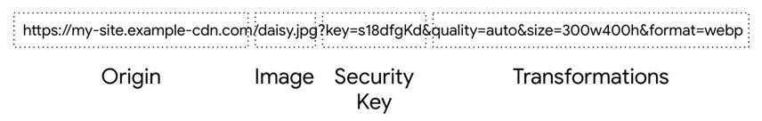
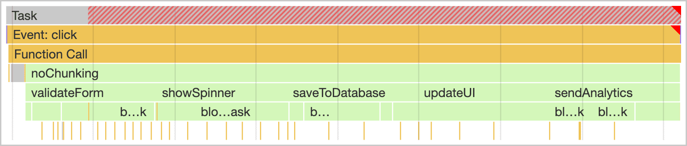
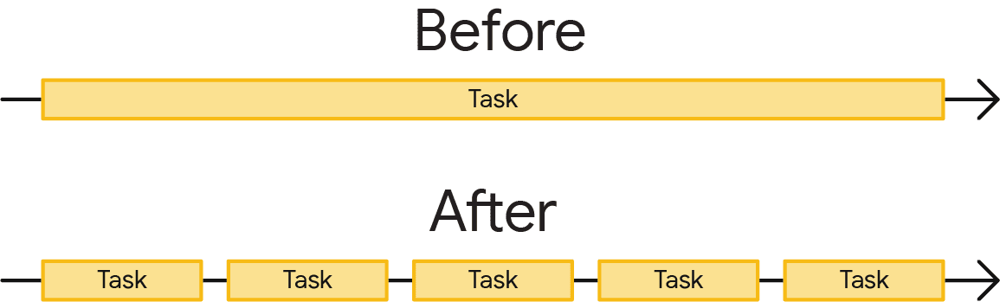
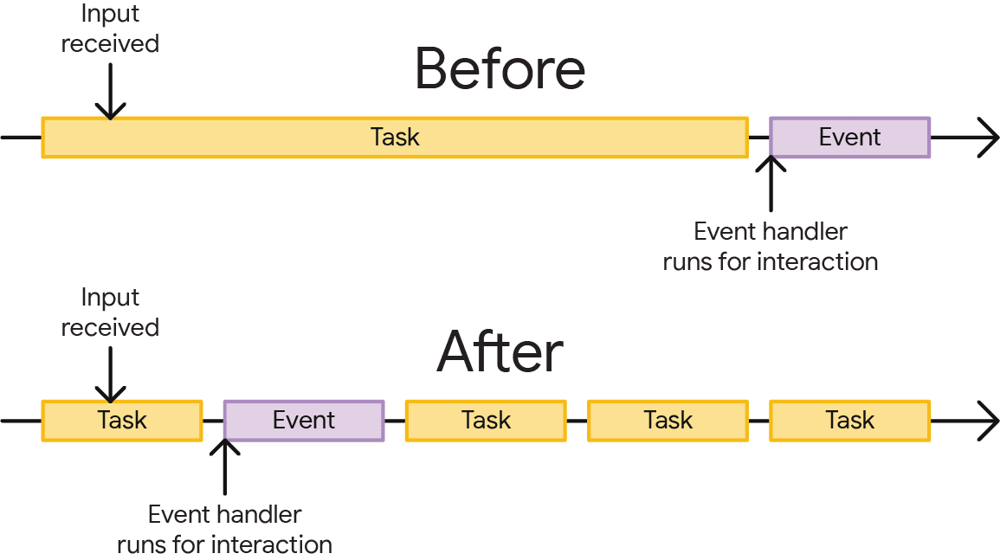

## image cdn

图片 CDN 专门用于转换、优化和交付图片。您也可以将它们视为用于访问和处理网站上使用的图片的 API。对于从图片 CDN 加载的图片，图片 URL 不仅指示要加载哪张图片，还指示尺寸、格式和质量等参数。


使用Webp格式图片,不要使用Gif格式，下载很大

## 延迟加载图片

## 优化js长任务
主线程是大多数任务在浏览器中运行的位置，您编写的几乎所有 JavaScript 都在主线程中执行。

主线程一次只能处理一个任务。任何耗时超过 50 毫秒的任务都属于耗时较长的任务。对于超过 50 毫秒的任务，其总时间减去 50 毫秒后，称为任务的阻塞期。

浏览器会在任何长度的任务运行时阻止交互，但只要任务运行时间不过长，用户就不会察觉到这种情况。但是，如果用户在执行许多耗时较长的任务时尝试与页面进行交互，界面会感觉无响应，如果主线程长时间处于阻塞状态，甚至可能被破坏。



为防止主线程被阻塞的时间过长，您可以将一个长任务拆分为几个较小的任务。



这一点很重要，因为当任务分解时，浏览器可以更快地响应优先级更高的工作，包括用户互动。之后，剩余任务会运行完成，确保您最初加入队列的工作已经完成。



手动推迟代码执行

开发人员用来将任务分解为较小任务的一种方法是setTimeout()

```js
function yieldToMain () {
  return new Promise(resolve => {
    setTimeout(resolve, 0);
  });
}

async function saveSettings () {
  // Create an array of functions to run:
  const tasks = [
    validateForm,
    showSpinner,
    saveToDatabase,
    updateUI,
    sendAnalytics
  ]

  // Loop over the tasks:
  while (tasks.length > 0) {
    // Shift the first task off the tasks array:
    const task = tasks.shift();

    // Run the task:
    task();

    // Yield to the main thread:
    await yieldToMain();
  }
}
```

:::tip
另外关于这部分需要结合具体的打包工具进行配置
:::