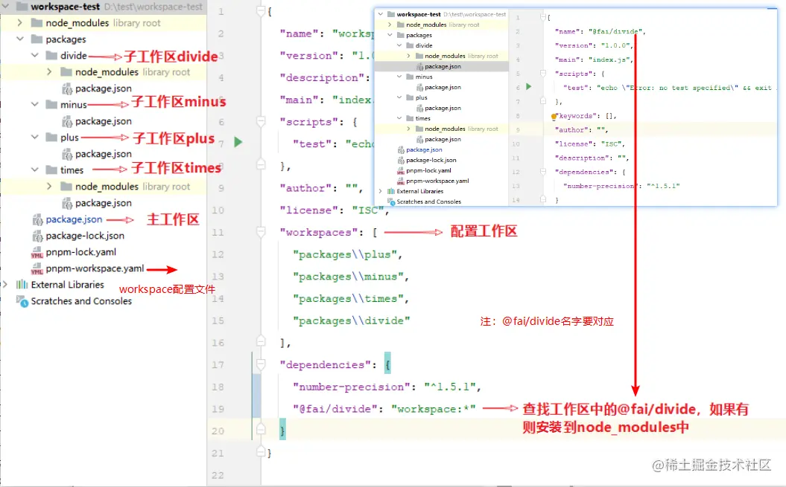

:::tip
vue 使用 pnpm作为管理工具，是处理monorepo架构不错的方法  
:::
## 包和模块的概念
1. 包必须有package.json文件为了发布到npm仓库
2. 模块可以是任何目录或文件,如果有package.json文件必须有一个main字段
:::tip
注意：由于模块不要求有package.json文件，所以并非所有模块都是包。只有有文件的模块package.json才是包。
:::
## 节省空间
使用 npm 时，如果您有 100 个项目使用某个依赖项，那么您将在磁盘上保存该依赖项的 100 个副本。使用 pnpm，依赖项将存储在内容可寻址存储中，因此：

如果您依赖依赖项的不同版本，则只有不同的文件才会添加到存储中。例如，如果它有 100 个文件，而新版本只对其中一个文件进行了更改，pnpm update则只会将 1 个新文件添加到存储中，而不是仅为了单个更改而克隆整个依赖项。

所有文件都保存在磁盘上的一个位置。安装软件包时，它们的文件会从该位置进行硬链接，不会占用额外的磁盘空间。这样您就可以在项目之间共享同一版本的依赖项。
因此，您可以节省与项目和依赖项数量成比例的大量磁盘空间，并且安装速度会更快！

1. 硬链接指向的是文件的 inode 号码，即多个硬链接实际上是文件系统中同一个文件的多个名称。所有硬链接都指向同一个物理数据块。
2. 软链接指向的是另一个文件的路径。软链接本身是一个特殊的文件，它存储着它所指向文件的路径信息，而非直接指向文件的 inode。软链接类似于Windows系统中的快捷方式。

## 通过不是扁平化的node_modules 修复phantom dependencies

假设我们启动一个新项目并安装一个依赖项：express。

Yarn1 和 npm 不仅会创建一个包含 express 的 node_modules 文件夹。相反，它们会将 express 的所有依赖项复制到 node_modules 中，这意味着我们的 modules 文件夹不仅有一个依赖项（express），还会有数十个依赖项的依赖项以及依赖项的依赖项。

例如，express有“parseurl”作为依赖项。由于它在我们的 node_modules 中有一个文件夹，因此以下代码将正常运行而不会出现任何错误：

```js
const parseUrl = require("parseurl");
```
即使我们从来没有直接安装过“parseurl”。

这个问题被称为“幽灵依赖”。

为了解决这个问题，pnpm 将只在我们的 node_modules 内创建 express 文件夹，并且 express 的依赖项将位于node_modules/.pnpm内。

如果我们现在尝试执行与之前相同的代码，NodeJS 将抛出一个错误，说无法找到“parseurl”。

我们永远不应该使用未在 package.json 中列出的依赖项，但使用扁平的 node_modules 时，我发现这种情况发生的频率比我希望的要高

## package.json
### files
```json
 "files": [
    "index.js",
    "dist"
  ],
```
:::info
npm包作为依赖安装时要包括的文件，格式是文件正则的数组，["*"]代表所有文件。也可以使用npmignore 来忽略个别文件。 files字段优先级最大，不会被npmignore和.gitignore覆盖。
:::
### main
项目入口，如果模块叫做a，之后下载导入它，可以认为引入了这个main指向的文件

如果没有配置，默认是代表index.js
### bin
许多软件包都有一个或多个可执行文件，它们想要安装到 PATH 中。npm 使这变得非常容易

```json
"bin" : { 
  "oui" : "./cli.js" 
}
```
控制台执行oui，相当于执行这个文件

需要在可执行文件头部加上#!/usr/bin/env node

当只有一个可执行文件且名字和包名一样，可以直接写成字符串形式。

```json
"bin": "./cli.js"
```
### script
参考  

<a href="https://blog.csdn.net/Triumph_light/article/details/135636652" target="_blank" rel="noreferrer">csdn</a>  
<a href="https://www.ruanyifeng.com/blog/2016/10/npm_scripts.html" target="_blank" rel="noreferrer">npm scripts 使用指南-阮一峰</a>

###  peerDependency(显式依赖核心库) 
1. 要求项目拥有peerDependencies所指定的环境依赖, 完成子环境要求父环境具有某些依赖包
2. 避免类似的核心依赖库被重复下载的问题。

定义在项目中  
peerDependencies 主要用于依赖包中，在项目中不起作用。

install 时 peerDependencies 不会被安装，开发时一般会配合 devDependencies 来实现开发和发包时的版本解耦。
```json
{
    "peerDependencies": {
        "react": "16 || 17 || 18"
    },
    "devDependencies": {
        "react": "16"
    }
}
```

install 时 peerDependencies 不会安装，但是包管理器会检查项目的依赖与 peerDependencies 是否匹配，如果版本不匹配或未安装，将会弹出警告。

包开发将依赖定义在 peerDependencies 中来避免项目中和依赖包中出现重复安装包所导致的包版本不相容、打包了多份不同版本的库等问题。

此外通过 peerDependenciesMeta 可以让 peerDependencies 作为可选依赖项，让开发者可以有选择性的选择需要的包：
```json
{
    "peerDependenciesMeta": {
        "soy-milk": {
            "optional": true
        }
    }
}
```
## Workspaces

```yaml
# pnpm-workspace.yaml
packages:
  - 'packages/*'
  - 'apps'
```
代表packages下一层的文件都是分包

apps是一个分包

### 公共管理
在项目跟目录下运行 pnpm install，pnpm 会根据当前目录 package.json 中的依赖声明安装全部依赖，在 workspace 模式下会一并处理所有子模块的依赖安装。

安装项目公共开发依赖，声明在根目录的 package.json - devDependencies 中。-w 选项代表在 monorepo 模式下的根目录进行操作。
可能会出现WARN Issues with peer dependencies found


### 子包管理

1. 为指点子模块添加依赖

```js
// 为 a子模块 包安装 lodash 
pnpm --filter a i -S lodash // 生产依赖
pnpm --filter a i -D lodash // 开发依赖
```
2. 指定子模块相互的依赖
可以看到这种写法，将子工作区导出到node_modules中，供所有工作区使用
```json
    "@vueuse/core": "workspace:*",
    "@vueuse/integrations": "workspace:*",
    "@vueuse/math": "workspace:*",
    "@vueuse/metadata": "workspace:*",
    "@vueuse/rxjs": "workspace:*",
    "@vueuse/shared": "workspace:*",
```


例如: a 依赖同是内部模块 b
```json
{
  "name": "a",
  // ...
  "dependencies": {
    "b": "workspace:^"
  }
}
```

在实际发布 npm 包时，workspace:^ 会被替换成内部模块 b 的对应版本号(对应 package.json 中的 version 字段)。替换规律如下所示：
```json
{
  "dependencies": {
    "a": "workspace:*", // 固定版本依赖，被转换成 x.x.x
    "b": "workspace:~", // minor 版本依赖，将被转换成 ~x.x.x
    "c": "workspace:^"  // major 版本依赖，将被转换成 ^x.x.x
  }
}
```

## catalog
```json
packages:
  - packages/*

# Define a catalog of version ranges.
catalog:
  react: ^18.3.1
  redux: ^5.0.1
```
```json
{
  "name": "@example/app",
  "dependencies": {
    "react": "catalog:",
    "redux": "catalog:"
  }
}
```
相当于
```json
{
  "name": "@example/app",
  "dependencies": {
    "react": "^18.3.1",
    "redux": "^5.0.1"
  }
}
```

在工作区（即 monorepo 或多包存储库）中，许多包使用相同的依赖项是很常见的。目录减少了编写package.json文件时的重复，并提供了以下一些好处：

1. 维护唯一版本— 通常，工作区中最好只有一个版本的依赖项。目录使维护起来更容易。重复的依赖项可能会在运行时发生冲突并导致错误。使用捆绑器时，重复项也会增加大小。
2. 升级更简单pnpm-workspace.yaml— 升级依赖项时，只需编辑目录条目，而不必package.json编辑使用该依赖项的所有文件。这样可以节省时间 — 只需更改一行，而不是多行。
3. 更少的合并冲突- 由于package.json在升级依赖项时不需要编辑文件，因此这些文件中不再发生 git 合并冲突。
